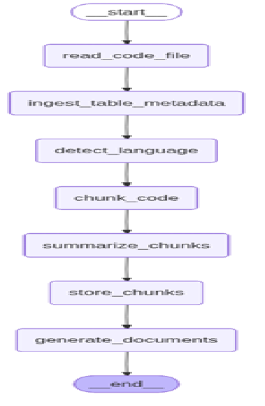
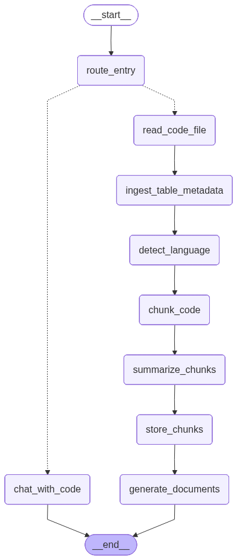

# 📊 SQL/PLSQL Summarization Pipeline

This pipeline summarizes large-scale SQL and PLSQL codebases using LangGraph, Groq-hosted LLMs, and Qdrant for semantic search. It supports schema-aware summarization, chunk-level logic analysis, and high-level documentation generation — ideal for enterprise demos, code audits, and metadata traceability.

---

## 🚀 Features

- ✅ Summarizes stored procedures, functions, and scripts
- ✅ Supports Java, Python, and SQL/PLSQL code
- ✅ Schema-aware: integrates table metadata for context
- ✅ Handles multi-file inputs and large codebases
- ✅ Stores summaries in Qdrant for semantic search
- ✅ Outputs high-level and detailed documentation

---

## 📂 Input Formats

### 1. Single File

```python
flow.invoke({
  "file_path": "path/to/code.sql"
})
```

### 2. Multiple File(Merged)

```python
code = merge_sql_files([
  "functions.sql",
  "procedure.sql"
])

flow.invoke({
  "code": code}
)
```

### 3. With Table Metadata

```python
flow.invoke({
  "file_path": "code.sql",
  "metadata_file": "table_metadata.json"
})

```

Supports:

- Single table object
- List of table objects
- Dict of tables (auto-converted)

📘 Output

- high_level_doc: Purpose-driven summary per chunk
- detailed_doc: Logic-level explanation with control flow
- table_names: Extracted from metadata
- Stored chunks in Qdrant for semantic search

🧠 Table Metadata Format

```json
[
  {
    "table_name": "Employees",
    "description": "Stores employee details",
    "columns": {
    "EmployeeID": "INT PRIMARY KEY",
    "FirstName": "VARCHAR(50)",
    ...
    }
  }
]
```

Also supports:

```json
{
  "table_name": "...",
  "description": "...",
  "columns": { ... }
}
```

🛠️ Architecture

- LangGraph: Orchestrates summarization flow
- Groq LLMs: Gemma/Mixtral for summarization
- Qdrant: Stores chunk embeddings for search
- LangChain: Embedding + vector store integration

🛠️ Langgraph Flow



🛠️ Additional Semantic Search to the flow



🧪 Testing
Supports:

- .sql, .java, .py files
- 2000+ line stored procedures
- Multi-function ingestion
- Metadata-aware summarization

🧩 Extensibility

- Add Langflow JSON for visual orchestration
- Add audit trace: link chunks to table usage


